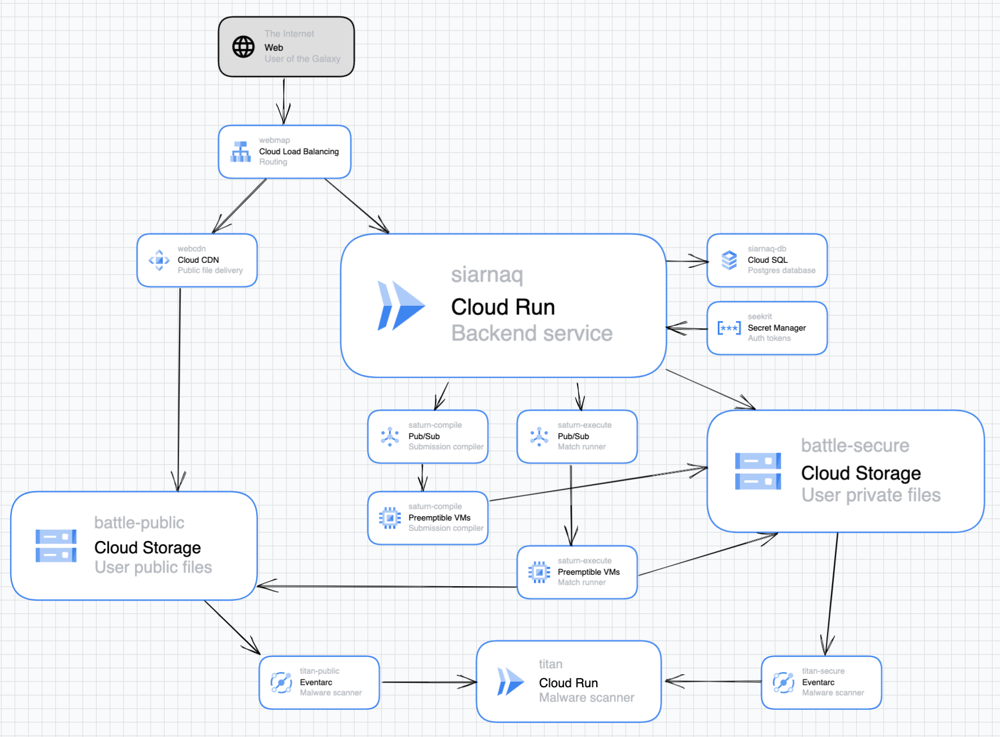

# Deploy instructions

We use Terraform to deploy our infrastructure, to ensure full documentation of our
resources and ease of reproducibility. See these instructions for how to use it.

## How to develop and deploy

tl;dr:

- To install dependency Terraform modules: `terraform init`
- To check what Terraform would change: `terraform plan`
- To make Terraform changes: `terraform apply`

### Getting started

You should have installed the Google Cloud SDK and authenticated it as yourself. Ensure
your conda environment contains `terraform` as required by the environment specification
at the root of this repository.

This should be sufficient to get running. **Do not generate any keys for any service
account**: if you do, we may summarily revoke them without consulting you, because their
existence is a security risk. Instead, Terraform has been configured to automatically
impersonate (convert to) the Terraform service account, where minimal permissions are
granted.

### Making changes

Whenever you make changes and apply them, you should add and commit all `.tf` files as
well as the `.terraform.lock.hcl` file.

Whenever you create a new resource, think about sizing. Be warned that small resources
(especially shared-core ones) might not be sufficient for high-traffic components, and
might only be sufficient for testing environments.

### Initial Terraform configuration

_These steps have already been completed, but are noted here for posterity._

There is a first time for everything. When initializing Terraform for the first time in
a new project:

- Create a Google Cloud Storage bucket for Terraform to manage its state. Name it as
  specified in `state.tf`.
- Create a Service Account for Terraforom to access and manage your resources. Name it
  as specified in `variables.tf`. Grant it roles permitting it to administer all
  resources you require.

### Shutting down

You can shut everything off with `terraform destroy`. Be warned that this might not
actually destroy all resources, because some resources are configured to stick around.
But also, why would you ever need to run this?

## The system design architecture

In terraform:

- `siarnaq` owns the Cloud Run, Cloud SQL, and Secret Manager modules, as well as the
  Pub/Sub topics.
- `saturn` owns its Pub/Sub subscriptions and compute clusters.
- `ganymede` (coming soon) owns its Pub/Sub subscription and Cloud Function.
- `network` owns the Load Balancer and Cloud CDN configurations.
- `cd` owns the Continuous Deployment setup.

## Todos, and old notes

- Re-deploy Saturn when images are updated (rolling replace).
- Support secrets that are not randomly generated (eg. external auth tokens). May
  require use of commands like `terraform apply -var-file="secret.tfvars"`
- Finer-grain access control to packages, to prohibit access before game release.
