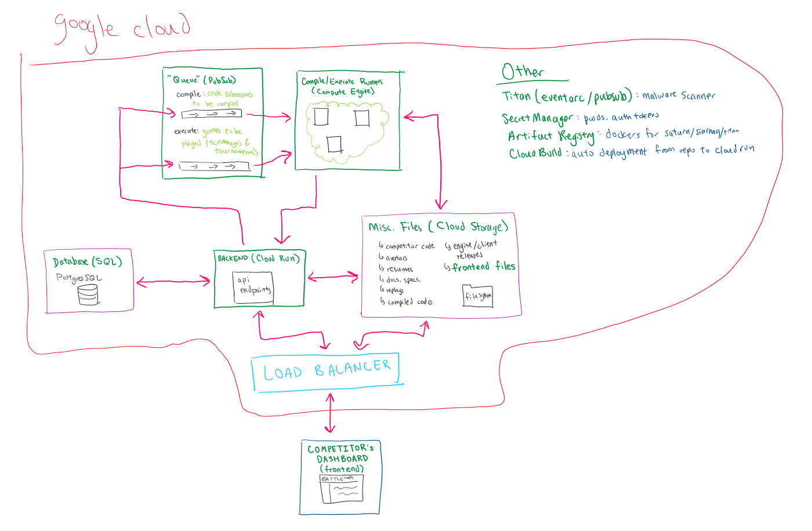

# General onboarding

(See frontend- and backend- specific folders for less specific materials.)

## Get some experience!

First and foremost, the easiest way to get a handle on our codebase is to use everything. Go to the deployed production website, make an account, join a team, upload a bot, and start playing.

It similarly helps to run as much of the Battlecode stack as you can, especially the backend and frontend. Follow the steps in the top-level readme to set up conda, and then see each of the backend and frontend's readmes as well.

## Goals of the product

Allow a user to:

- scrimmage
- submit code
- view Battlecode information
- manage their team and user

The latter two are fairly straightforward; the first two are more complex, and involve our entire system.

## Webinfra system overview

This is a rough depiction of how webinfra code runs in practice / in deployment. All of the systems in use are run through the Google Cloud Program (GCP).

## The big stuff

Here, we introduce the systems through tracking the flow of information.

First, a competitor uses their own computer to load up `play.battlecode.org`, thus visiting the _frontend_. Through the competitor's interactions, the frontend makes Internet requests to the _backend_. The backend allows these requests via the _API_, an interface that the backend defines to communicate with the outside world. Finally, the backend stores and retrieves bulk amounts of data in the _database_.

For viewing general information or managing team/user data, the flow of data generally ends here. However, when a user wants to submit new source code for their bot, or request a scrimmage against another team... these are more involved.

Most importantly, in these cases, the backend puts info about this request onto a _Pub/Sub_, which works very similarly to a queue. (We use two of these, one for submitting code and the other for requesting scrimmages.)
Furthermore, the backend also stores other information into the database for records. Also, for a submission, the backend saves the competitor's source code in _Google Cloud Storage_. (This is Google's simple file storage, which works similarly to Google Drive or other file-and-folder based stores.)

This request is then taken off the respective queue and processed by either a _compile runner_ (also called a compile server or submission server) or a _execute runner_ (also called an execute server or scrimmage server). A compile runner takes in the request, gets the competitor's source code from Cloud Storage, compiles this code through running Java commands, uploads the compiled code back to Cloud Storage, and tells the backend to update the database accordingly (to reflect the completion of compilation). An execute runner follows a similar process, though with matches rather than submissions.

### Other parts

While these parts need less active work and maintenance from devs, they are still important to know.

_Titan_ is our integrated malware scanner. At the end of competition, competitors upload files ostensibly containing their resumes to our site, which are compiled into a resume book given to sponsors. To prevent funny business, Titan intercepts and scans these files, and marks safe ones.

The _Secret Manager_ is a Google product, that holds our internal secrets, such as our password to manage the database. This prevents us from having to put passwords and authentication tokens in our code (ask older devs for horror stories). Instead, deployed components access Secret Manager to get the passwords, and can inject these into the flow of code.

The _Artifact Registry_ is a Google product that holds and organizes Docker containers. We use containers to standardize and deploy our backend servers and our compile/execute runners. The number of total servers running at any time scales up and down depending on how much we need, through processes we have defined ourselves.

(Docker is an amazing service that enables standardized servers to run across different operating systems. You can learn more at [their page](https://www.docker.com).)

Google's _Cloud Build_ turns our source code into real machines running that code, and allows us to manage and customize this process as well.

An extra layer of abstraction is created with the _Load Balancer_. This takes all HTTP requests to our domain, and points each request to the right place in our system.

Furthermore, many of these systems can have multiple instances running. For example, GCP can run multiple backend servers, in order to do more operations at the same rate, thus handling more network traffic and competitor usage. This scalability is enabled by the Load Balancer, which can distribute requests across these multiple instances.
