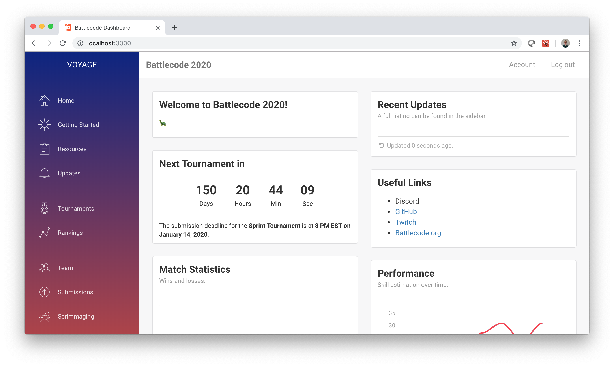

# Battlecode Frontend

Fully static frontend in React, based on `battlecode19/app`, using modified template from http://creative-tim.com.

**I would strongly recommend -- if not mandate -- that you read over this page, in full, before doing any frontend work.**



## Development Workflow

### High-level Goals

The guiding principle behind Battlecode's frontend development: **A competition should be easy to administer, and the code should be easy to understand and work with.**

To this end are several more-specific objectives, that also guide development. See here: https://github.com/battlecode/galaxy/milestones

This is a consequence of how Battlecode runs as a competition and as a team. In short, Battlecode frontend development can be understaffed yet still need spiky labor, a dangerous combination that's important to mitigate.

As a competition, user activity occurs mostly during January, and within that, mostly during specific moments or days in January. Similarly, the website's contents need to be changed during specific moments in January, such as when the game is released or tournaments occur. All of this requires large efforts from devs during small amounts of times. So, it's important to mitigate this, by reducing the amount of steps needed to run a competition and by making each of these steps easier.

As a team, Battlecode has a few quirks. First, the team -- especially the webinfra team -- is small, and devs collectively have little time and bandwidth. Compounding this, the webinfra team must allot their efforts to frontend, backend, infra, deploy engineering, and much more. Finally, frontend work can simply be unexciting. Devs, new and veteran, tend to be more excited by the prospect of doing engine or client work, since that's the core product of Battlecode. This makes it even harder to gather time and effort to work on webinfra.

### To-do Organizing

Todos are tracked first and foremost on GitHub's Issues list. Any frontend-relevant issues should have their title include "[frontend]". Issues are either labeled with `enhancement` or `critical`. The `critical` label is for todos that will seriously impact Battlecode, for example by creating dangerous bugs, or creating work that piles on later for devs. The `enhancement` is for less-impactful todos. (A rule of thumb is that even if `enhancement` todos are not done, Battlecode will still run smoothly and will not need overly-skilled/hyperspecialized devs. This does not apply to `critical` todos of course.)

Further, these issues can also be categorized via GitHub's Milestones. There are various milestones relating to the frontend work, and issues that cleanly match a milestone are assigned to that milestone. You can see the list of milestones from the issues list.

To track and organize progress on the issues, we use GitHub's Projects. See here for the frontend project: https://github.com/battlecode/galaxy/projects/2. The left column lists the high-level goals and milestones, in order to make sure we're always aware of the big picture. Then, issues and PRs are sorted into high, medium, or low priority.

### To-do Creation

When _any_ frontend-related task makes itself known (eg by your testing, other reports, code flaws, etc):

- Create an issue. Make sure its title includes "[frontend]". Label it with "enhancement" or "critical"; see the "To-do organizing" section and use your judgement to classify this. Finally, if applicable, add it to a relevant milestone.

- Please do **not write "TODO" in code. Instead, create an issue, and leave a comment referencing that issue**. It's easy to write TODOs in the code and then forget about them or never see them. The Issue list is a much safer place to track them.

- If it needs to be be actively in the team's conscience, then add it to the project board.

### Work Decisions

Now, say you're trying to do some work, and you look at the Issues list to pick a task to do.

**Before you begin a task, make a decision on whether you want to -- or should -- do this task.**

For any task, **think about the benefits of doing it**. It's especially helpful to think of how much dev time is lost to not doing it: how much extra hoops devs jump through to do simple tasks, how much time devs spend instructing users to carry out workarounds, etc. Of course, _security holes and breaking bugs_ have extreme benefit, since the cost of not doing them -- that is, having breaking bugs and security holes -- is as high as it could be.

Sometimes tasks may not be highly beneficial. For instance, you could be making a change to a one-line piece of code that devs would not be stumbling on anyways, or simplifying a workflow that occurs once-a-year during dead time.

**On the other hand, judge the costs.** Remember that **your product takes effort, both to create and then to maintain.** Even if this task is easy to do in the short run, someone (perhaps not you) will have to be in charge of using your product and maintaining it in the long run. The frontend team's lack of time makes this especially problematic.

So, **consider being light on features and new code.** This is an all-new creation of code, and yet another distinct piece of technology that someone on the team will have to wrap their head around. This person will have to learn from scratch (rather than simply replacing/updating knowledge).

**Deciding whether to do other tasks, such as automation and refactors, involves more nuance.** Sometimes, the cost of _not_ doing this task is high. For example, the cost of not having automation for a frequent or time-sensitive operation can be high, because the manual process would require high effort. And frontend devs already are strained with effort! Another example is refactoring code that is likely to be touched again later: trying to add a feature to already-bad code becomes extremely hard, so that's a high long-term cost.

### Working

A rule of thumb: **If you're not making forward progress for 10 minutes, ask for help**. This _includes making progress but nothing that's clearly in the direction of your solution_. While there is benefit in self-discovery, it might not be worth that extra time, effort, and potential frustration. Instead, the benefits of productivity are generally worth it. This especially holds for the frontend dev team and limited time. (Plus, asking for help is a useful skill, and the _habit_ to ask for help is useful too!)

Similarly, **if you can't solve a problem after 20 minutes, think about trying a different solution or just not solving it**. While clean code and clean solutions are good, it's perhaps not worth the effort, especially with how much work among Battlecode/frontend there is to do and how little time Battlecode devs have. Perhaps the problem could take a different approach. Or perhaps you don't even need to solve _this specific problem: zoom one level out, and try something different there that avoids this problem altogether_.

_An important caveat:_ Don't merge terrible-quality work, of course. The effort needed to learn and maintain that is tough. So, if you write hacky or unelegant solutions, at least make sure others can follow your code along. PR review ought to help this.

Feel free to adjust those minute values as you see fit, especially given the ebbs and flows of team workload and team size/bandwidth/resources/time. The general practices still hold and would still be useful.

### Engineering Principles

Write **well-written code**. In particular, prefer code that's **ETU**, SFB, and RFC (thanks 6.031!). Especially here, _simplicity is good_, especially given lack of working resources.

From that, modularity is also good, since this makes code much more easy to reason with and understand. This modularity can be found in many pairs of components: between back and frontend, _and between each part of frontend (e.g. between api and other things_), and finally within the same component too.

Another practice that keep things simple is only deriving/manipulating each piece of data in one place, and then passing it down as-is in other places, as much as possible. This especially helps you reason with data being communicated back and forth.

(While code that is performant or cool has its merits, such merits aren't as valuable in the fast-moving development of Battlecode)

## Local Development Instructions

### One-Time Setup

First, make sure you have [Node](https://nodejs.org/en/download/) installed. (Also, on Windows, [Cygwin](https://www.cygwin.com/) is recommended to use as your terminal environment.) Then, in this directory, run:

```
npm install
```

### Running

Make sure that the backend is running. (You can hook up to a deployed backend, or run it locally. Then make sure `.env.development` points to that backend.)

In **this directory**, run:

```
npm run start
```

This automatically reloads the page on changes. To run the same thing without automatically opening a browser, run `npm run startx`, and then navigate to http://localhost:3000.

### Notes

When installing a new Node package, always `npm install --save <package>` or `npm install --save-dev <package>`, and commit `package.json` and `package-lock.json`. This should work even if we run it from Docker. If you don't have `npm` installed on your computer, you can `docker exec -it battlecode20_frontend_1 sh` and then run the commands above.

Our local processes use `npm start` and/or `npm run start`. These commands automatically use `.env.development`, and not `.env.production`. See here for more information: https://create-react-app.dev/docs/adding-custom-environment-variables/#what-other-env-files-can-be-used.

### NPM 17 sadness

In order for npm 17 to work with these, **run `export NODE_OPTIONS=--openssl-legacy-provider` before you run any npm commands**.

(New versions of npm are incompatible with old versions of webpack. See https://stackoverflow.com/questions/69665222/node-17-0-1-gatsby-error-digital-envelope-routinesunsupported-err-ossl-evp for more.

Our issues would be resolved if we could use new versions of webpack but)

### access.txt

During deployment, you'll need an up-to-date version of `frontend/public/access.txt`. This file is needed by game runners to run matches, and by competitors because it grants them access to downloading the GitHub package containing the engine. It's is really difficult to deploy; our solution is to have it deployed with the rest of the frontend code and onto our website, but have it never pushed to GitHub. Make sure you have an up-to-date copy! If you don't have one, check with the infra devs.

## Deployment

### One-time setup

#### AWS

We first need to register the subdomain.

1. Go to [Route 53 on AWS](https://console.aws.amazon.com/route53/home?region=us-east-1#).
2. Go to the [battlecode.org hosted zone](https://console.aws.amazon.com/route53/v2/hostedzones#ListRecordSets/Z2GXL51TK1J2YK).
3. Click `Create record` (big orange button), then Simple routing > Define simple record.
4. Type in the subdomain name (e.g. `play`), route traffic to the IP address 35.186.192.112 (or whatever the Google Cloud load balancer's IP address is). Leave the record type as A, and the TTL can be whatever.
5. **Update the URLs in `.env.production` to this new URL.**
6. **Update `"homepage"` of `package.json` to match the new domain (in full, not just subdomain)**.

This should create the subdomain `[subdomain-name].battlecode.org` and point it to our load balancer.

#### Google Cloud

We now need to set up a new bucket, and set up the load balancer to point to the bucket when navigating to the right address.

1. In the Google Cloud web console, go to [Storage > Storage > Browser](https://console.cloud.google.com/storage/browser?project=battlecode18&prefix=).
2. Click `Create bucket`.
3. Name it something like `bc22-frontend`.
4. Leave most options at the default setting, but change the access control to "Uniform" from "Fine-grained".
5. Create the bucket.
6. Go to the "Permissions" section in the newly created bucket. Click "Add user" and **type in `allUsers` with the role "Storage Object Viewer"**.
7. Download the `gcloud` command line tool if you haven't done so yet, sign into your account and choose the battlecode account, and **run `gsutil web set -m index.html -e index.html gs://[bucket]` (_with the name of the bucket_) from your terminal**. This will make all pages, including error pages, point to the single page React app that we have.
8. **Update the bucket name in the `deploy.sh` script, to match the new domain name.**

This sets up the bucket. Finally, we need to set up the load balancer to point to the bucket:

1. In the Google Cloud web console, go to [Network > Network services > Load balancing](https://console.cloud.google.com/net-services/loadbalancing/loadBalancers/list?project=battlecode18).
2. Go to the `web-map` load balancer.
3. Click "Edit".
4. Under "Backend configuration", edit the `frontend-backend-bucket`. This is a backend bucket, which points to a cloud storage bucket of your choice. Make it point to the newly created frontend bucket.
5. Under "Host and path rules", add the rule with host `[new domain name]`, path `/*` and backend the newly created bucket.
6. Under "Frontend configuration", open up the HTTPS configuration, click the "Certificate" drop-down, and click "Create a new certificate". Name it something, select "Create Google-managed certificate" and enter all domains (which should be all domains previously in use, e.g. `battlecode.org`, `2021.battlecode.org`, etc, **plus the new domain you just added**, e.g. `play.battlecode.org`).
7. Under "Review and finalize", make sure everything looks good.
8. Click "Update".
9. Wait for like 10 minutes!

Now, you should be able to follow the deployment instructions above (`npm run build` and `./deploy.sh deploy`) to deploy the website and see it live on your new subdomain! **Don't forget to actually deploy! See the "Continuous Deployment" section.**

### Continuous Deployment

Run`./deploy.sh deploy` using Bash. This script calls `npm run build` to build a static copy of the website, and then uploads it to Google Cloud. (The dpeloy setup should have already been done.) Note that this automatically uses `.env.production`.

The servers that serve the deployed frontend never run npm (through Docker or otherwise). Instead, our deploy script runs npm locally to build the frontend, and then sends this compiled version to Google Cloud.
